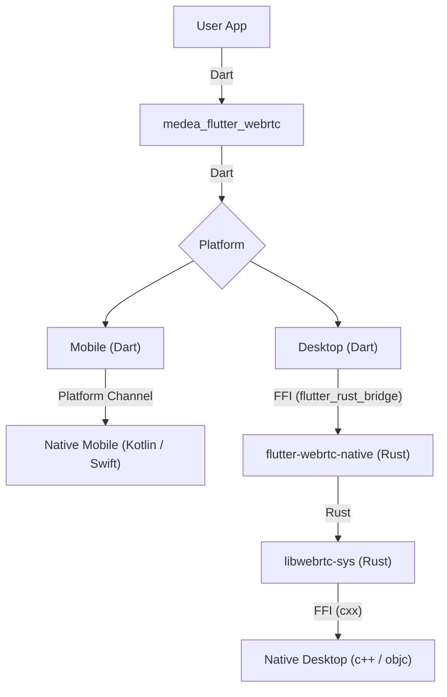

# medea_flutter_webrtc

WebRTC plugin for Flutter Mobile/Desktop.
Designed to be used as backend for [medea-jason] and uses `libwebrtc` built in [libwebrtc-bin].
Initially a fork of a [flutter-webrtc] but at this moment there is hardly anything left from the initial upstream version.

Supported platforms:
- macOS 10.11+
- Linux (with Pulse and X11 for screen sharing)
- Windows
- Android 24+
- iOS 13+
- Web (somewhat, since web support is implemented in [medea-jason])

## Usage

Add `medea_flutter_webrtc` as a [dependency in your pubspec.yaml file](https://flutter.io/using-packages/).

### iOS

Add the following entry to your _Info.plist_ file, located in `<project root>/ios/Runner/Info.plist`:

```xml
<key>NSCameraUsageDescription</key>
<string>$(PRODUCT_NAME) Camera Usage!</string>
<key>NSMicrophoneUsageDescription</key>
<string>$(PRODUCT_NAME) Microphone Usage!</string>
```

This entry allows your app to access camera and microphone.

### Android

Ensure the following permission is present in your Android Manifest file, located in `<project root>/android/app/src/main/AndroidManifest.xml`:

```xml
    <uses-feature android:name="android.hardware.camera" />
<uses-feature android:name="android.hardware.camera.autofocus" />
<uses-permission android:name="android.permission.ACCESS_NETWORK_STATE" />
<uses-permission android:name="android.permission.CAMERA" />
<uses-permission android:name="android.permission.CHANGE_NETWORK_STATE" />
<uses-permission android:name="android.permission.INTERNET" />
<uses-permission android:name="android.permission.MODIFY_AUDIO_SETTINGS" />
<uses-permission android:name="android.permission.RECORD_AUDIO" />
```

If you need to use a Bluetooth device, please add:

```xml
<uses-permission android:name="android.permission.BLUETOOTH" android:maxSdkVersion="30" />
<uses-permission android:name="android.permission.BLUETOOTH_ADMIN" android:maxSdkVersion="30" />
<uses-permission android:name="android.permission.BLUETOOTH_CONNECT" />
```

The Flutter project template adds it, so it may already be there.

Also you will need to set your build settings to Java 8, because official WebRTC jar now uses static methods in `EglBase` interface. Just add this to your app level `build.gradle`:

```groovy
android {
    //...
    compileOptions {
        sourceCompatibility JavaVersion.VERSION_1_8
        targetCompatibility JavaVersion.VERSION_1_8
    }
}
```

If necessary, in the same `build.gradle` you will need to increase `minSdkVersion` of `defaultConfig` up to `21` (currently default Flutter generator set it to `16`).

### Main components interaction scheme



### Important reminder
When you compile the release apk, you need to add the following operations,
[Setup Proguard Rules](https://github.com/flutter-webrtc/flutter-webrtc/commit/d32dab13b5a0bed80dd9d0f98990f107b9b514f4)

### Example

For more examples, please refer to [flutter-webrtc-demo](https://github.com/cloudwebrtc/flutter-webrtc-demo/).


[medea-jason]: https://github.com/instrumentisto/medea-jason
[libwebrtc-bin]: https://github.com/instrumentisto/libwebrtc-bin
[flutter-webrtc]: https://github.com/flutter-webrtc/flutter-webrtc
